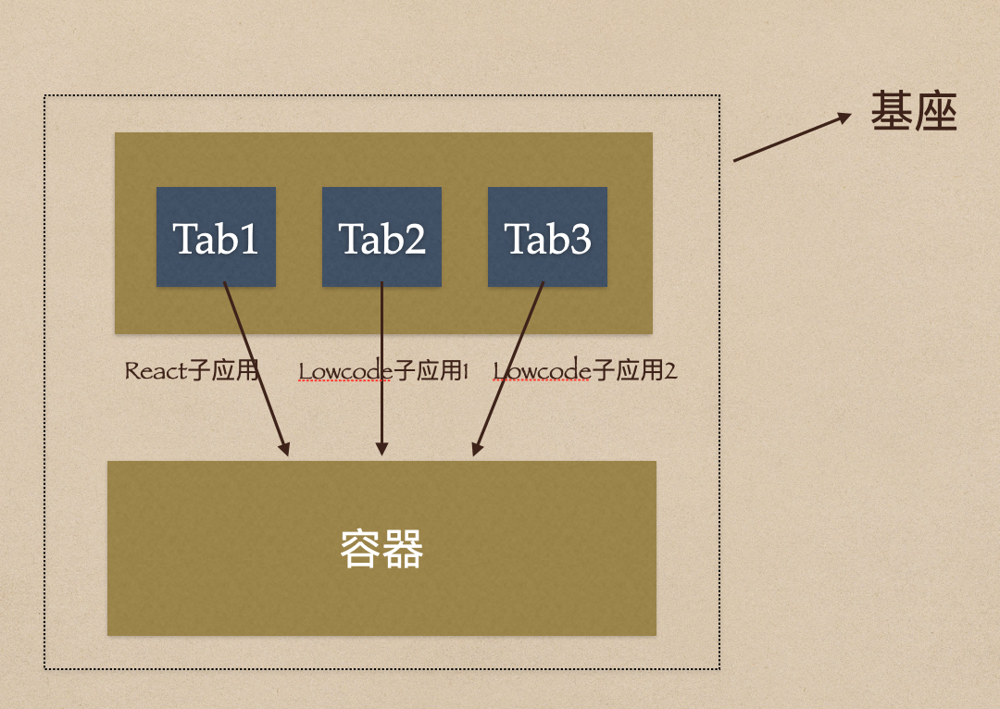

# micro-app-demo
micro app

试验一下微前端框架处理以下场景的效果：  
  
有3个Tab，其中一个Tab下的模块是用常规的 React 写的，还有两个 Tab 是用低代码平台搭建的。也就是说现在有3个现成的链接，技术栈完全不同，需要将其混合在一个Tab列表下，看上去像一个整体应用。但是 iframe 的各种缺陷比较明显，因此使用 `micro app` 来尝试一下，看下是否能解决该问题。  
  
设想的效果如下图所示： 

